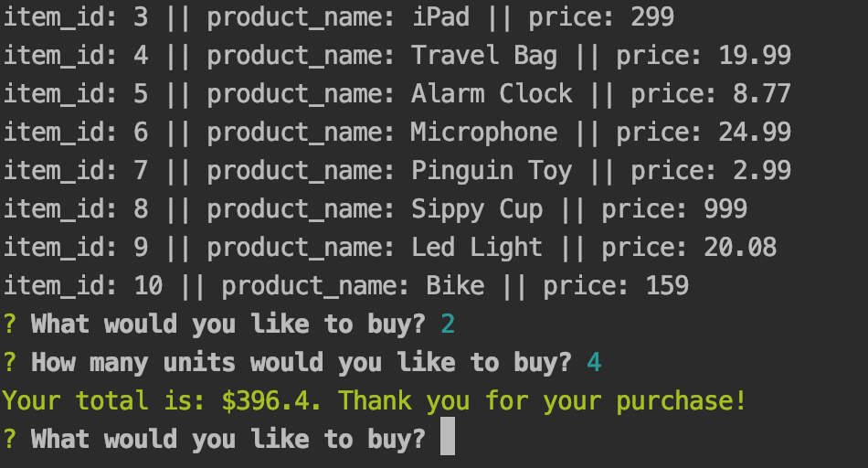

# Bamazon
An Amazon-like store front using Node.js and MySQL, where you can view the inventory, choose an item you'd like to purchase and the quantity. After the transaction is completed you will see the total for your purchase.SQL database reflects the remaining quantity. In case if there is not enough product, customer will see "Insufficient quantity!" message.

# Technologies used:

* MySQL
* JavaScript
* Node.JS

# Required NPM Packages:

* MySQL
* cli-color
* inquirer 

# Screenshots Walkthrough 

 

 

 

 
MYSQL TABLE INVENTORY UPDATE
 

 

 

# BamazonManager
BamazonManager edition allows you to:

    * View Products for Sale
    
    * View Low Inventory
     
    * Add to Inventory
    
    * Add New Product
    
    * Exit
    
## Screenshots Walkthrough 

 

 

 

 
